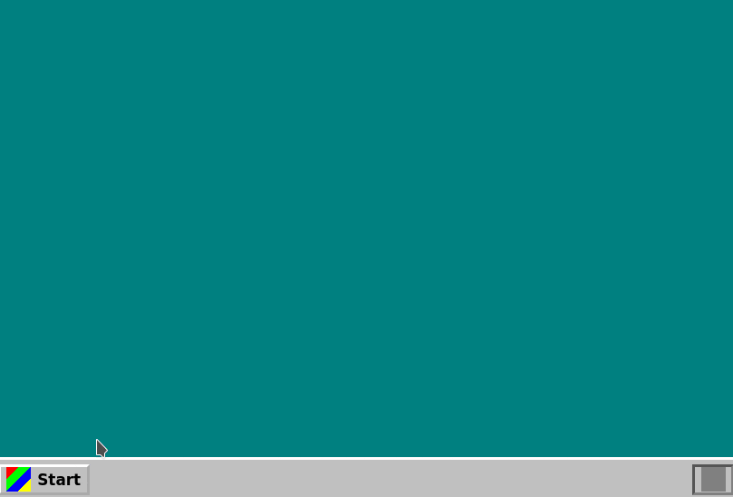

# OS/402 Desktop

Write 8080 assembly. Compile it to a `.COM` binary. Run it as a CGI program that renders live HTML—all inside your browser, on a Z80 emulator running CP/M 2.2.



That's `HTML.ASM` being assembled, outputting `<h1>Hello</h1>` through BDOS console calls, parsed and rendered in a sandboxed iframe. Forty-five years of computing history, running at 4MHz, building fully-interactive web pages - the 'next generation' ecosystem.

## Explore

- [`packages/`](./packages/) — Turbo Pascal, BDS C, assemblers, and how to create your own
- [`src/cpm/`](./src/cpm/) — Z80 emulator, BDOS/BIOS implementation, virtual filesystem
- [`src/apps/`](./src/apps/) — Workspace IDE, CGI viewer, programs menu
- [`src/themes/`](./src/themes/) — Nirvana (Win95), Cupertino (Mac), OLED (mobile)

## Features

### Desktop Environment
- **Window Manager** — Draggable, resizable windows with minimize/maximize/close
- **Taskbar** — Application launcher with running window indicators
- **Multi-window** — Run multiple workspaces and applications simultaneously

### CP/M 2.2 Emulation
- **Z80/8080 CPU** — Cycle-accurate emulation with full instruction set
- **BDOS & BIOS** — Complete CP/M system calls (file I/O, console, disk operations)
- **Virtual Filesystem** — Multiple drives (A:, B:, C:...) with drag-and-drop file upload
- **Terminal** — Interactive CP/M command line with XCCP shell enhancements

### Development Workspace
- **Integrated Editor** — Syntax-aware text editing for assembly, Pascal, C, BASIC
- **File Browser** — Navigate drives, create/rename/delete files
- **Build System** — One-click compile with automatic tool detection
- **Multiple Languages**:
  - 8080/Z80 Assembly (ASM.COM, Z80MR, ZASM)
  - Pascal (Turbo Pascal 3, Pascal MT+)
  - C (BDS C)
  - BASIC (CBASIC)

### CGI Web Applications
- **HTML Output** — CP/M programs generate dynamic HTML pages
- **Form Handling** — GET and POST with query strings and request bodies
- **Environment Variables** — CGI.ENV file with QUERY_STRING, CONTENT_LENGTH, etc.
- **Live Reload** — Edit assembly, compile, and see results instantly

### Cross-Window Messaging
- **Hierarchical Namespaces** — Apps addressed like `workspace.1.cgi.b.hello.win-1`
- **Pattern Matching** — Route messages with regex patterns
- **Named Shortcuts** — `@siblings`, `@cousins`, `@workspace` for easy targeting
- **Context Store** — Hierarchical shared state with LDAP-style inheritance

### Package System
- **ZIP-based Packages** — Drop a `.zip` onto any drive or click the `+` icon to load
- **Download Drives** — Click the download icon to export any drive as a `.zip` (with manifest intact)
- **MANIFEST.MF** — Declare actions, file patterns, and build commands
- **Auto-discovery** — Packages add tools and menu actions automatically
- **Portable Workspaces** — Backup, customize, and swap entire drives as zip files

See [`packages/`](./packages/) for examples including Turbo Pascal, BDS C, and assemblers.

**Manifest format** (`MANIFEST.MF`):
```json
{
  "name": "Turbo Pascal 3",
  "actions": [
    {
      "id": "turbo3",
      "name": "Turbo Pascal 3",
      "command": "TURBO",
      "patterns": ["*.PAS"],
      "outputExts": ["COM"],
      "interactiveScript": [
        { "wait": "(Y/N)?", "send": "Y" },
        { "wait": "E)dit", "send": "W" },
        { "wait": "Work file name:", "send": "{drive}:{name}.PAS\r" },
        { "wait": "Loading", "send": "O" },
        { "wait": "(Q)uit", "send": "C" },
        { "wait": ")om-file", "send": "Q" },
        { "wait": ">", "send": "C" },
        { "wait": "Compiling", "send": "Q" }
      ]
    }
  ]
}
```

**Package commands:**
```bash
npm run pkg:list      # List available packages
npm run pkg:build     # Build all packages to public/packages/
npm run pkg:validate  # Validate manifest files
```

---

## Technical Architecture

```
┌─────────────────────────────────────────────────────────┐
│                    Browser (Host)                        │
├─────────────────────────────────────────────────────────┤
│  Desktop Environment                                     │
│  ├── Window Manager (drag, resize, z-order)             │
│  ├── MessageBus (postMessage routing)                   │
│  └── Context Store (hierarchical state)                 │
├─────────────────────────────────────────────────────────┤
│  Applications                                            │
│  ├── Workspace Manager (IDE)                            │
│  ├── CP/M Terminal                                      │
│  └── CGI Viewer (iframe sandbox)                        │
├─────────────────────────────────────────────────────────┤
│  CP/M Layer                                              │
│  ├── CpmEmulator (Z80 CPU + BDOS/BIOS)                  │
│  ├── VirtualFS (in-memory filesystem)                   │
│  ├── Package Loader (ZIP extraction)                    │
│  └── Interactive Scripts (wait/send automation)         │
├─────────────────────────────────────────────────────────┤
│  Z80 Emulator Core                                       │
│  ├── 64KB address space                                 │
│  ├── All Z80/8080 instructions                          │
│  └── T-state accurate timing                            │
└─────────────────────────────────────────────────────────┘
```

---

## Aesthetic & UX Philosophy

This isn't just Windows 95's visual language—it's a rediscovery of the operational mode that powered the golden era of small business computing in the 80s and 90s.

**Workspaces, not applications.** There's no app store, no installers, no ecosystem lock-in. You get a Workspace with the basics included, and you *build things*. Write code, compile it, run it, ship it. The tool gets out of your way.

**Copy that floppy.** Distribution is a `.zip` file. Drag it onto a drive, and you're running. Download a drive, email it to a colleague, post it online. The entire environment is portable, shareable, forkable. This is how software spread before walled gardens—and it works surprisingly well for the internet age.

**Visual design:**
- **3D Beveled Controls** — Classic raised/sunken button states
- **System Colors** — The iconic `#c0c0c0` gray with navy blue title bars
- **Bitmap Fonts** — MS Sans Serif-style typography
- **Chunky Scrollbars** — Period-accurate sizing with arrow buttons

The terminal emulates the classic CRT aesthetic while the workspace channels Borland's Turbo series—functional, fast, no-nonsense.

---

## The Road Not Taken: HTML Apps

This project chose the **CGI path**: CP/M programs output HTML through stdout, parsed and rendered in sandboxed iframes. An alternative approach would have been **native HTML apps**:

### CGI Approach (What We Built)
```
┌──────────────┐     ┌──────────────┐     ┌──────────────┐
│  8080 ASM    │ ──► │  CP/M BDOS   │ ──► │  HTML Output │
│  Program     │     │  Console I/O │     │  in iframe   │
└──────────────┘     └──────────────┘     └──────────────┘
```
- Programs are `.COM` binaries running in emulated CPU
- Output via BDOS function 9 (print string, `$`-terminated)
- Forms/links intercepted and re-run the CGI
- Authentically constrained to 1970s-80s computing

### HTML App Approach (Alternative)
```
┌──────────────┐     ┌──────────────┐     ┌──────────────┐
│  HTML/JS     │ ──► │  postMessage │ ──► │  Desktop     │
│  in iframe   │     │  API         │     │  Services    │
└──────────────┘     └──────────────┘     └──────────────┘
```
- Apps are modern HTML/CSS/JS in iframes
- Full access to browser APIs via postMessage bridge
- Richer UI possibilities, less historically authentic

The CGI approach creates a more cohesive experience—you're genuinely running 45-year-old software architectures, just faster. The constraints force creativity: want a button? Output `<button>` from assembly. Want state? Parse CGI.ENV.

The messaging system (`@siblings`, `@workspace`) bridges both worlds, letting CGI apps participate in modern IPC patterns while remaining true to their BDOS-outputting nature.

---

## Messaging API

The desktop provides a hierarchical messaging system for cross-window communication.

### Address Format

```
{namespace}.{app}.{windowType}.{windowId}
```

Example: `workspace.1.cgi.b.hello.win-1`

### Named Shortcuts

Instead of complex regex patterns, use shortcuts:

| Shortcut | Resolves To | Use Case |
|----------|-------------|----------|
| `@self` | Exact sender address | Echo, acknowledgment |
| `@siblings` | Same parent + wildcard | Other instances of same app |
| `@cousins` | Grandparent + wildcard | Sibling apps |
| `@workspace` | First 2 parts + wildcard | All windows in workspace |
| `@app` | Parent namespace | Exact parent match |

### Sending Messages (from iframe)

```javascript
// Send to sibling windows
parent.postMessage({
  type: 'ping',
  to: '@siblings',
  payload: { timestamp: Date.now() }
}, '*');

// Direct message with regex pattern
parent.postMessage({
  type: 'update',
  to: 'workspace\\.1\\.cgi\\..*',
  payload: { data: 'hello' }
}, '*');
```

### Receiving Messages

```javascript
window.addEventListener('message', (e) => {
  const { type, from, payload } = e.data;
  console.log(`${type} from ${from}:`, payload);
});
```

### Pattern Examples

| Pattern | Matches |
|---------|---------|
| `workspace\.1\.cgi\.b\.hello\.win-1` | Exact window |
| `workspace\.1\.cgi\..*` | All CGI apps in workspace 1 |
| `workspace\.1\..*` | Everything in workspace 1 |
| `.*` | Global broadcast |

Dots must be escaped (`\.`) as these are regex patterns. The sender is automatically excluded from broadcasts.

---

## Quick Start

```bash
# Install dependencies
npm install

# Start development server
npm run dev

# Run tests
npm test

# Production build
npm run build
```

---

## License

MIT
